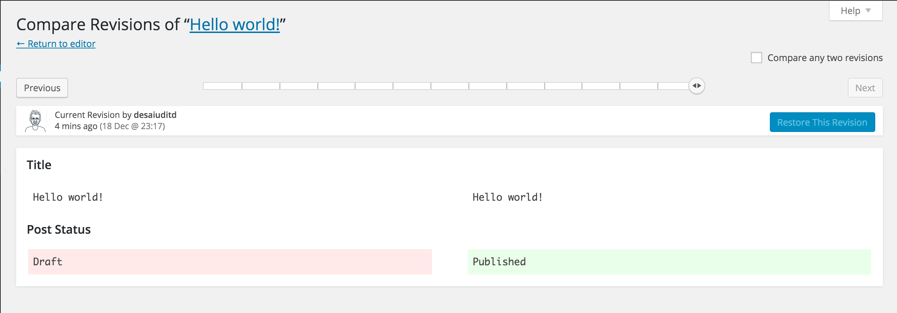

<!-- DO NOT EDIT THIS FILE; it is auto-generated from readme.txt -->
# Watchman

Watchman is a WordPress plugin which keeps track of revisions for your posts, pages and custom post types as well.

**Contributors:** [desaiuditd](https://profiles.wordpress.org/desaiuditd)  
**Tags:** [revision](https://wordpress.org/plugins/tags/revision), [revisions](https://wordpress.org/plugins/tags/revisions), [post](https://wordpress.org/plugins/tags/post), [posts](https://wordpress.org/plugins/tags/posts), [page](https://wordpress.org/plugins/tags/page), [pages](https://wordpress.org/plugins/tags/pages), [custom post types](https://wordpress.org/plugins/tags/custom post types), [custom post type](https://wordpress.org/plugins/tags/custom post type), [WordPress](https://wordpress.org/plugins/tags/WordPress), [history](https://wordpress.org/plugins/tags/history), [track](https://wordpress.org/plugins/tags/track), [track post](https://wordpress.org/plugins/tags/track post), [track posts](https://wordpress.org/plugins/tags/track posts), [edit flow](https://wordpress.org/plugins/tags/edit flow)  
**Requires at least:** 3.6  
**Tested up to:** 4.4  
**Stable tag:** master  
**License:** [GPLv2 or later](http://www.gnu.org/licenses/gpl-2.0.html)  
**Donate Link:** Paypal ID : desaiuditd@gmail.com  

 

## Description ##

Following are some of the trivial features:

 * Tracks Post Title & Post Content - inherits from WordPress Core
 * Controls number of revisions for all post types
 * Tracks Post Author
 * Tracks Post Date
 * Tracks Featured Image
 * Tracks Comments for a Post
 * Tracks Metadata
 * Tracks Terms from Taxonomy

**NOTE**: Development in progress

**Important Links ( Future Links - doesn't exist right now )**

* [Project Homepage](http://blog.incognitech.in/watchman/ "Visit Watchman's Homepage")
* [Roadmap](http://blog.incognitech.in/watchman/roadmap/ "Visit Watchman's Roadmap page")
* [Documentation](http://blog.incognitech.in/watchman/docs/ "Visit Watchman's Documentation page")
* [FAQ](http://blog.incognitech.in/watchman/faq/ "Visit Watchman's FAQ page")
* [GitHub](http://github.com/desaiuditd/watchman/) - Please mention your wordpress.org username when sending pull requests.

## Installation ##

* Install the plugin from the 'Plugins' section in your dashboard (Go to `Plugins > Add New > Search` and search for Watchman).
* Alternatively, you can [download](http://downloads.wordpress.org/plugin/watchman.zip "Download Watchman") the plugin from the repository. Unzip it and upload it to the plugins folder of your WordPress installation (`wp-content/plugins/` directory of your WordPress installation).
* Activate it through the 'Plugins' section.

## Frequently Asked Questions ##

Please visit [Watchamn's FAQ page](http://blog.incognitech.in/watchman/faq/ "Visit Watchman's FAQ page").

Read Watchman [Documentation](http://blog.incognitech.in/watchman/docs/)

## Screenshots ##

### Watchman Settings Page

### Track Post Author in Revisions. User Display Name & User ID of the author is shown.

### Track Post Status in Revisions. Label of Post Status is shown.

### Set Revision Limit for individual posts.

## Changelog ##

Please visit [Watchman's Roadmap page](http://blog.incognitech.in/watchman/roadmap/ "Visit Watchman's Features page") to get some details about future releases.
### 0.7.1 ###
* Adds Screenshot for #12

### 0.7 ###
* Fixes #12 - Revision Limit for Individual Posts
* Fixes #14 - User can stop saving revisions for post type with number 0

### 0.6 December 18, 2015 ###
* Fixes #6 - Track Post Status
* Fixes #7 - Track Post Date
* Fixes #13 - Stops unnecessary revisions getting created
* Adds Settings link in Plugin Row Action
* Fixes few Translation Strings

### 0.5 December 17, 2015 ###
* Post Author tracking added.
* This update is coming after a long time & I've got this breakthrough to track the restricted fields as well.
* So I hope to get more updates soon with proposed features. Kudos!

### 0.4 December 12, 2014 ###
* Screenshot added

### 0.3 December 12, 2014 ###
* Plugin title changed

### 0.2 Decempber 11, 2014 ###
* Watchman Settings introduced
* Revision Limit by Post Type
* Watchman Icon added

### 0.1 Decempber 03, 2014 ###
* Plugin Scaffolding
* Basic Functionality
* Travis Setup

## Upgrade Notice ##

None.

